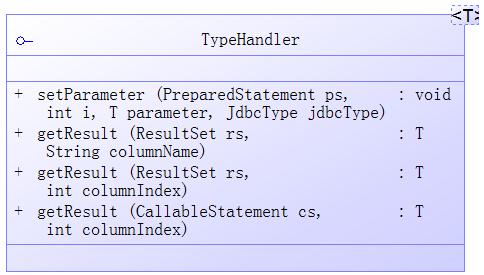
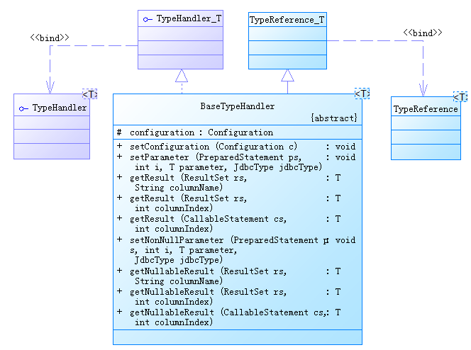

#StartFromZero-MyBatis
##MyBatis TypeHandler
*draft:*
- 功能介绍
- handler接口解读，包括typehandler接口、typeregistry、
- 内置typehandler
- 自定义typehandler
- 注册typehandler
- 不足：无法创建带有有参构造的handler，解决办法
- 处理resultset的完整流程

###TypeHandler简介
现实业务中，Java对象与数据库表字段之间并不是完全匹配的，可能表中存储的只是Java对象的一个具有代表性的属性值。这样在通过JDBC进行数据库操作时，就涉及怎样把Java对象存储到数据库，怎样把数据库中某个字段的值对应上某个Java对象的问题。  
预编译的SQL语句对象`PreparedStatement`提供了多个设置不同类型参数的方法，如：  
```java
setObject(int parameterIndex, Object x, int targetSqlType)
setString(int parameterIndex, String x)
setInt(int parameterIndex, int x)
...
```
同样的结果集对象`ResultSet`提供了获取不同类型参数值得方法，如：  
```java
getObject(String columnLabel) 
getString(String columnLabel)
getInt(String columnLabel) 
```
MyBatis作为优秀的持久层框架，不可能让使用者针对不同的业务场景写这些底层枯燥臃肿的代码。MyBatis提供了类型转换的机制，统一针对具体的类型设定具体的类型处理器，使用者只需要关心如何在Java类与类型处理器之间进行映射即可。此外，MyBatis内置了大量的类型处理器类，几乎涵盖了所有常见的Java类型。使用者可以视具体情况自定义具体的类型处理器。  

###TypeHandler接口
####TypeHandler接口
  
```java
public interface TypeHandler<T> {
  void setParameter(PreparedStatement ps, int i, T parameter, JdbcType jdbcType) throws SQLException;
  T getResult(ResultSet rs, String columnName) throws SQLException;
  T getResult(ResultSet rs, int columnIndex) throws SQLException;
  T getResult(CallableStatement cs, int columnIndex) throws SQLException;
}
```
####BaseTypeHandler接口
  
`BaseTypeHandler`抽象类实现了`TypeHandler`接口，对其进一步封装，提供了预处理参数为空和结果集为空情况下的默认处理，对外细化了4个方法接口，分别为预处理参数非空处理方法，以及结果集处理的3个重载方法：  
```java
  public abstract void setNonNullParameter(PreparedStatement ps, int i, T parameter, JdbcType jdbcType) throws SQLException;

  public abstract T getNullableResult(ResultSet rs, String columnName) throws SQLException;

  public abstract T getNullableResult(ResultSet rs, int columnIndex) throws SQLException;

  public abstract T getNullableResult(CallableStatement cs, int columnIndex) throws SQLException;
```
###TypeHanlder处理器类
####内置TypeHandler
MyBatis内置的诸多TypeHandler均继承自`BaseTypeHanTypeHandlerdler`：  
  

|Type Handler|Java Types|JDBC Types|
|:--|:--|:--|
|BooleanTypeHandler|java.lang.Boolean,boolean|Any compatible BOOLEAN|
|ByteTypeHandler|java.lang.Byte, byte|Any compatible NUMERIC or BYTE|
|ShortTypeHandler|java.lang.Short, short|Any compatible NUMERIC or SHORT INTEGER|
|IntegerTypeHandler|java.lang.Integer, int|Any compatible NUMERIC or INTEGER|
|LongTypeHandler|java.lang.Long, long|Any compatible NUMERIC or LONG INTEGER|
|FloatTypeHandler|java.lang.Float, float|Any compatible NUMERIC or FLOAT|
|DoubleTypeHandler|java.lang.Double, double|Any compatible NUMERIC or DOUBLE|
|BigDecimalTypeHandler|java.math.BigDecimal|Any compatible NUMERIC or DECIMAL|
|StringTypeHandler|java.lang.String|CHAR, VARCHAR|
|ClobTypeHandler|java.lang.String|CHAR, VARCHAR|
|NStringTypeHandler|java.lang.String|NVARCHAR, NCHAR|
|NClobTypeHandler|java.lang.String|NCLOB|
|ByteArrayTypeHandler|byte[]|Any compatible byte stream type|
|BlobTypeHandler|byte[]|BLOB, LONGVARBINARY|
|DateTypeHandler|java.util.Date|TIMESTAMP|
|DateOnlyTypeHandler|java.util.Date|DATE|
|TimeOnlyTypeHandler|java.util.Date|TIME|
|SqlTimestampTypeHandler|java.sql.Timestamp|TIMESTAMP|
|SqlDateTypeHandler|java.sql.Date|DATE|
|SqlTimeTypeHandler|java.sql.Time|TIME|
|ObjectTypeHandler|Any|OTHER, or unspecified|
|EnumTypeHandler|Enumeration Type|VARCHAR any string compatible type, as the code is stored (not index)|
|EnumOrdinalTypeHandler|Enumeration Type|Any compatible NUMERIC or DOUBLE, as the position is stored (not the code itself).|
StringTypeHandler实现示例：  
```java
public class StringTypeHandler extends BaseTypeHandler<String> {

  @Override
  public void setNonNullParameter(PreparedStatement ps, int i, String parameter, JdbcType jdbcType)
      throws SQLException {
    ps.setString(i, parameter);
  }

  @Override
  public String getNullableResult(ResultSet rs, String columnName)
      throws SQLException {
    return rs.getString(columnName);
  }

  @Override
  public String getNullableResult(ResultSet rs, int columnIndex)
      throws SQLException {
    return rs.getString(columnIndex);
  }

  @Override
  public String getNullableResult(CallableStatement cs, int columnIndex)
      throws SQLException {
    return cs.getString(columnIndex);
  }
}
```
####自定义TypeHandler
尽管MyBatis已经内置了大量的类型处理器，但也可能会有无法满足实际业务需要的情况出现，此时就需要自定义类型处理器。  
就处理枚举类型来讲，虽然MyBatis提供了`EnumOrdinalTypeHandler`、`EnumTypeHandler`两个类型处理器，但简单分析他们的功能后发现并不能很好的匹配实际需求。  
`EnumOrdinalTypeHandler`顾名思义，即使用枚举变量的ordinal属性进行设置参数和结果集与枚举类型映射。ordinal属性为枚举变量定义的顺序，从0开始（详细的介绍请查阅Java Doc）。  
下面来看下核心代码段：  
```java
public class EnumOrdinalTypeHandler<E extends Enum<E>> extends BaseTypeHandler<E> {

  public EnumOrdinalTypeHandler(Class<E> type) {
    this.type = type;
    this.enums = type.getEnumConstants();
  }

  @Override
  public void setNonNullParameter(PreparedStatement ps, int i, E parameter, JdbcType jdbcType) throws SQLException {
    // ordinal作为参数值
	ps.setInt(i, parameter.ordinal());
  }

  @Override
  public E getNullableResult(ResultSet rs, String columnName) throws SQLException {
    int i = rs.getInt(columnName);
	// ordinal作为下标获取枚举对象
    return enums[i];
  }
}
```

类似的，`EnumTypeHandler`使用枚举变量名设置参数和结果集与枚举类型映射。  
下面来看下核心代码段：  
```java
public class EnumTypeHandler<E extends Enum<E>> extends BaseTypeHandler<E> {

  public EnumTypeHandler(Class<E> type) {
    this.type = type;
  }

  @Override
  public void setNonNullParameter(PreparedStatement ps, int i, E parameter, JdbcType jdbcType) throws SQLException {
    // 枚举变量名作为参数
    ps.setString(i, parameter.name());
  }

  @Override
  public E getNullableResult(ResultSet rs, String columnName) throws SQLException {
    String s = rs.getString(columnName);
	// 通过枚举变量名匹配枚举对象
    return s == null ? null : Enum.valueOf(type, s);
  }
}
```
此外，细心的你可能会发现，这里介绍的`EnumOrdinalTypeHandler`、`EnumTypeHandler`与上面样例中的`StringTypeHandler`实现略有不同。前两者均包含有参构造，而后者没有。仔细想想也不难理解，`StringTypeHandler`处理的目标对象是明确的，即`String`类型；而`java.lang.Enum`是一个抽象的概念，直到具体的枚举类型被创建出来类型才能确定，所以前两者更像是枚举类型处理器工厂，需要传入具体的枚举类型才能工作。  
`EnumOrdinalTypeHandler`和`EnumTypeHandler`是站在抽象层的类型处理解决方案，虽然可能解决不了实际问题，但也可以为我们提供一定的思路。  
枚举类型的形式多样，可以是`UserRole.ADMIN`、`UserRole.ADMIN("admin")`、`UserRole.ADMIN(1，"admin")`等。我们可以抽象出实际中所用到的枚举类型的统一接口，然后面向接口创建类型处理器。
下面以形如`ADMIN(1,"admin")`的枚举类型举例。  
接口定义如下:  
```java
public interface IGenericEnum {
	/**
	 * 获得枚举整型部分值，这里作为key值
	 * @return
	 */
	public int getInt();
	/**
	 * 获取枚举描述信息
	 * @return
	 */
	public String getString();
}
```
实际业务中的枚举类型：用户角色枚举类型`UserRoleEnum`、用户状态枚举类型`UserActiveStatusEnum`。  
```java
// 用户角色枚举类型
public enum UserRoleEnum implements IGenericEnum{

	SUPERADMIN(1, "superadmin"),
	ADMIN(2, "admin"),
	USER(3, "user");
	
	private final int roleId;
	private final String roleName;
	
	private UserRoleEnum(int roleId, String roleName){
		this.roleId = roleId;
		this.roleName = roleName;
	}

	@Override
	public int getInt() {
		return roleId;
	}

	@Override
	public String getString() {
		return roleName;
	}
}

// 用户状态枚举类型
public enum UserActiveStatusEnum implements IGenericEnum{
	// 未激活状态
	INACTIVE(0, "inactive"),
	// 已激活状态
	ACTIVE(1, "active");

	private final int key;
	private final String value;

	private UserActiveStatusEnum(int key, String value) {
		this.key = key;
		this.value = value;
	}
	@Override
	public int getInt() {
		return this.key;
	}

	@Override
	public String getString() {
		return this.value;
	}
}
```
`UserActiveStatusEnum`类型对应用户表的`ROLE  tinyint(1)`字段，`UserRoleEnum`类型对应用户表的`ACTIVE  tinyint(1)`字段。所以下面定义的类型处理器就负责为数字型的数据库列赋值、将结果集指定列中的数字型数据转换为相应的枚举类型。  
`IGenericEnum`接口的类型处理器，参考`EnumTypeHandler`的实现：  
```java
public class GenericEnumHandler<E extends IGenericEnum> extends BaseTypeHandler<E> {

	private Class<E> type;
	// 同样需要依赖具体的枚举类型
	public GenericEnumHandler(Class<E> type) {
		if (type == null) {
			throw new IllegalArgumentException("Type argument cannot be null");
		}
		this.type = type;
	}

	@Override
	public void setNonNullParameter(PreparedStatement ps, int i, E parameter, JdbcType jdbcType) throws SQLException {
		ps.setInt(i, parameter.getIntValue());
	}

	@Override
	public E getNullableResult(ResultSet rs, String columnName) throws SQLException {
		if (rs.wasNull()) {
			return null;
		} else {
			int key = rs.getInt(columnName);
			return EnumUtil.getEnumConstant(type, key);
		}
	}
	
	// 省略其他getNullableResult重载方法
}

//涉及的枚举工具类
public class EnumUtil {
	/**
	 * 根据枚举常量的int值，取得对应的枚举对象
	 * @param type 枚举类class
	 * @param key int值
	 * @return
	 */
	public static <E extends IGenericEnum> E getEnumConstant(Class<E> type, int key){
		E[] constants = type.getEnumConstants();
		if(null == constants){
			return null;
		}
		for(E c : constants){
			if(c.getIntValue() == key){
				return c;
			}
		}
		return null;
	}
}
```
###TypeHandler注册器 -- TypeHandlerRegistry
前面介绍了MyBatis内置了大量的类型处理器，那么这些处理器存储在哪，又是以什么方式存储的？那就要来看看`TypeHandlerRegistry`了。  
####TypeHandler的存储 TypeHandlerRegistry的内部结构
TypeHandler主要存在3个Map中：  
- JDBC_TYPE_HANDLER_MAP：具体JDBC类型的处理器类
	- key：JdbcType
	- value：TypeHandler
- TYPE_HANDLER_MAP：具体Java类型的处理器类
	- key：Type
	- value：Map：
		- key：JdbcType
		- value：TypeHandler
- ALL_TYPE_HANDLERS_MAP：登记所有的类型处理器
	- key：TypeHandler Class
	- value：TypeHandler

####TypeHandler的注册
上一节介绍了TypeHandler的存储结构，下面就来看下怎么配置TypeHandler。对于内置TypeHandler，是由MyBatis自己注册的。我们要关心的就是如何配置自定义TypeHandler。  
主要在3个地方配置TypeHandler:  
- 在MyBatis主配置文件中的`<typeHandlers>`元素中配置
- 在Mapper文件中具体列上配置
- 在自定义类型处理器上通过注解`@MappedTypes`配置

#####typeHandlers元素
配置形式：  
```xml
<typeHandlers>
	<package name="xxx"/>
	<typeHandler handler="xxx" javaType="xxx" jdbcType="xxx"/>
	<typeHandler handler="xxx" javaType="xxx" jdbcType="xxx"/>
	...
</typeHandlers>
```
- package：待扫描的自定义类型处理器包名
- handler：必选，自定义类型处理器的全限定类名或别名
- javaType：可选，该类型处理器适用的Java类型
- jdbcType：可选，该类型处理器适用的Jdbc类型

#####Mapper文件配置
```xml
<result column="xxx" property="xxx" 
	typeHandler="xxx" javaType="xxx" jdbcType="xxx" />
```
#####注解配置
```java
@MappedTypes({XXX.class, XXX.class})
@MappedJdbcTypes(value={JdbcType.XXX,JdbcType.XXX},includeNullJdbcType=true/false)
public class XXX extends BaseTypeHandler<XXX> {
}
```

####TypeHandler的注册时机

####TypeHandler的匹配