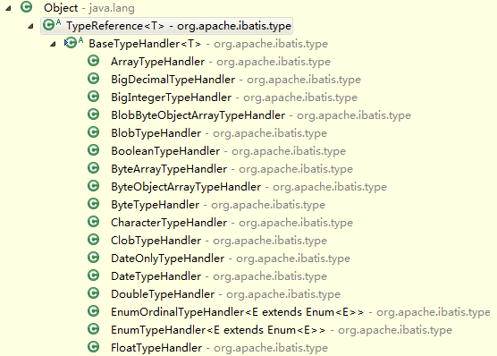

#StartFromZero-MyBatis
##MyBatis TypeHandler
*draft:*
- 功能介绍
- handler接口解读，包括typehandler接口、typeregistry、
- 内置typehandler
- 自定义typehandler
- 注册typehandler
- 不足：无法创建带有有参构造的handler，解决办法
- 处理resultset的完整流程

###TypeHandler简介
现实业务中，Java对象与数据库表字段之间并不是完全匹配的，可能表中存储的只是Java对象的一个具有代表性的属性值。这样在通过JDBC进行数据库操作时，就涉及怎样把Java对象存储到数据库，怎样把数据库中某个字段的值对应上某个Java对象的问题。  
预编译的SQL语句对象`PreparedStatement`提供了多个设置不同类型参数的方法，如：  
```java
setObject(int parameterIndex, Object x, int targetSqlType)
setString(int parameterIndex, String x)
setInt(int parameterIndex, int x)
...
```
同样的结果集对象`ResultSet`提供了获取不同类型参数值得方法，如：  
```java
getObject(String columnLabel) 
getString(String columnLabel)
getInt(String columnLabel) 
```
MyBatis作为优秀的持久层框架，不可能让使用者针对不同的业务场景写这些底层枯燥臃肿的代码。MyBatis提供了类型转换的机制，统一针对具体的类型设定具体的类型处理器，使用者只需要关心如何在Java类与类型处理器之间进行映射即可。此外，MyBatis内置了大量的类型处理器类，几乎涵盖了所有常见的Java类型。使用者可以视具体情况自定义具体的类型处理器。  

###TypeHandler接口
####TypeHandler接口
  
```java
public interface TypeHandler<T> {
  void setParameter(PreparedStatement ps, int i, T parameter, JdbcType jdbcType) throws SQLException;
  T getResult(ResultSet rs, String columnName) throws SQLException;
  T getResult(ResultSet rs, int columnIndex) throws SQLException;
  T getResult(CallableStatement cs, int columnIndex) throws SQLException;
}
```
####BaseTypeHandler接口
  
`BaseTypeHandler`抽象类实现了`TypeHandler`接口，对其进一步封装，提供了预处理参数为空和结果集为空情况下的默认处理，对外细化了4个方法接口，分别为预处理参数非空处理方法，以及结果集处理的3个重载方法：  
```java
  public abstract void setNonNullParameter(PreparedStatement ps, int i, T parameter, JdbcType jdbcType) throws SQLException;

  public abstract T getNullableResult(ResultSet rs, String columnName) throws SQLException;

  public abstract T getNullableResult(ResultSet rs, int columnIndex) throws SQLException;

  public abstract T getNullableResult(CallableStatement cs, int columnIndex) throws SQLException;
```

####内置TypeHandler
MyBatis内置的诸多TypeHandler均继承自`BaseTypeHandler`：  
  

|Type Handler|Java Types|JDBC Types|
|:--|:--|:--|
|BooleanTypeHandler|java.lang.Boolean,boolean|Any compatible BOOLEAN|
|ByteTypeHandler|java.lang.Byte, byte|Any compatible NUMERIC or BYTE|
|ShortTypeHandler|java.lang.Short, short|Any compatible NUMERIC or SHORT INTEGER|
|IntegerTypeHandler|java.lang.Integer, int|Any compatible NUMERIC or INTEGER|
|LongTypeHandler|java.lang.Long, long|Any compatible NUMERIC or LONG INTEGER|
|FloatTypeHandler|java.lang.Float, float|Any compatible NUMERIC or FLOAT|
|DoubleTypeHandler|java.lang.Double, double|Any compatible NUMERIC or DOUBLE|
|BigDecimalTypeHandler|java.math.BigDecimal|Any compatible NUMERIC or DECIMAL|
|StringTypeHandler|java.lang.String|CHAR, VARCHAR|
|ClobTypeHandler|java.lang.String|CHAR, VARCHAR|
|NStringTypeHandler|java.lang.String|NVARCHAR, NCHAR|
|NClobTypeHandler|java.lang.String|NCLOB|
|ByteArrayTypeHandler|byte[]|Any compatible byte stream type|
|BlobTypeHandler|byte[]|BLOB, LONGVARBINARY|
|DateTypeHandler|java.util.Date|TIMESTAMP|
|DateOnlyTypeHandler|java.util.Date|DATE|
|TimeOnlyTypeHandler|java.util.Date|TIME|
|SqlTimestampTypeHandler|java.sql.Timestamp|TIMESTAMP|
|SqlDateTypeHandler|java.sql.Date|DATE|
|SqlTimeTypeHandler|java.sql.Time|TIME|
|ObjectTypeHandler|Any|OTHER, or unspecified|
|EnumTypeHandler|Enumeration Type|VARCHAR any string compatible type, as the code is stored (not index)|
|EnumOrdinalTypeHandler|Enumeration Type|Any compatible NUMERIC or DOUBLE, as the position is stored (not the code itself).|

####TypeHandler注册器 -- TypeHandlerRegistry
前面介绍了MyBatis内置了大量的类型处理器，那么这些处理器存储在哪，又是以什么方式存储的？那就要来看看`TypeHandlerRegistry`了。  
#####TypeHandler的存储
TypeHandler主要存在3个Map中：  
- JDBC_TYPE_HANDLER_MAP：具体JDBC类型的处理器类
	- key：JdbcType
	- value：TypeHandler
- TYPE_HANDLER_MAP：具体Java类型的处理器类
	- key：Type
	- value：Map：
		- key：JdbcType
		- value：TypeHandler
- ALL_TYPE_HANDLERS_MAP：登记所有的类型处理器
	- key：TypeHandler Class
	- value：TypeHandler

#####TypeHandler的登记

####TypeHandler的匹配