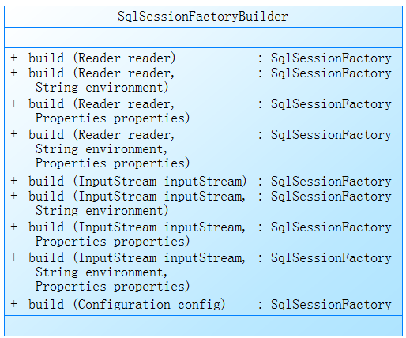
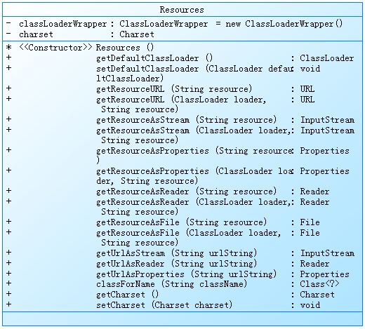
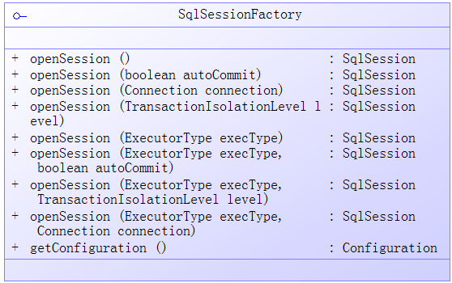
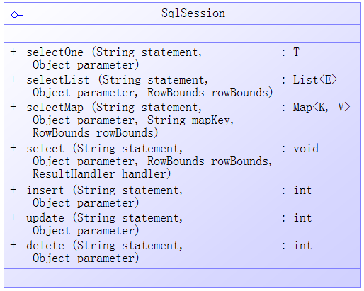
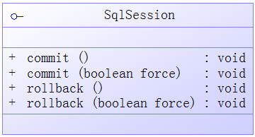

# StartFromZero-MyBatis
##简介
MyBatis是一种常见的Java持久层框架。减少了大量JDBC操作中机械、原始的代码，包括手动设置参数，操作结果集等。MyBatis支持手写SQL文，相较于其他O-R Mapping的框架更加灵活。  

##MyBatis XML配置

###1 properties
properties用于配置系统所需的键值对。MyBatis支持引用外部properties文件，同时支持properties元素配置，也支持在代码中传入Properties对象。常见配置如下:  
```xml
<!-- ② 引入外部properties文件 -->
<properties resource="org/mybatis/example/config.properties"> 
	<!-- ① 自定义属性 -->
	<property name="username" value="dev_user"/>
	<property name="password" value="F2Fa3!33TYyg"/>
</properties>
```
```java
/*③ Properties作为入参，创建SqlSessionFactory*/
SqlSessionFactory factory = sqlSessionFactoryBuilder.build(reader, props);
// 或者
SqlSessionFactory factory = sqlSessionFactoryBuilder.build(reader, environment, props);
```
通过`${xxx}`引用属性值：  
```xml
<dataSource>
	<property name="driver" value="${driver}"/>
	<property name="url" value="${url}"/>
	<property name="username" value="${username}"/>
	<property name="password" value="${password}"/>
</dataSource>
```
MyBatis加载Properties规则：  
- properties标签内配置的property项
- properties标签resource或url属性引用的外部properties文件中
- 创建SqlSessionFactory时传入的Properties对象  
如果有重复配置项，后面的将会覆盖前面的配置。  

###2 settings
settings用于全局配置MyBatis的运行时行为，包括缓存、加载方式等。  

|配置项|值域及默认值|含义|
|:--|:--|:--|
|cacheEnabled|true/false true|全局控制mapper文件中配置的cache|
|lazyLoadingEnabled|true/false false|全局控制是否延迟加载依赖属性|
|aggressiveLazyLoading|true/false true||
|multipleResultSetsEnabled|true/false true|是否允许一条语句返回多个结果集|
|useColumnLabel|true/false true|使用列标签还是列名称|
|useGeneratedKeys|true/false false|主键自增长|
|autoMappingBehavior|NONE/PARTIAL/FULL(包括内嵌属性) PARTIAL(不包括内嵌属性)|如何自动映射列和属性|
|defaultExecutorType|SIMPLE/REUSE/BATCH SIMPLE|默认executor|
|defaultStatementTimeout|正整数 未设置|数据库响应等待时间(秒)|
|defaultFetchSize|正整数 未设置|结果集数据最大条数|
|safeRowBoundsEnabled|true/false false|是否在内嵌的statement中使用RowBounds|
|mapUnderscoreToCamelCase|true/false false|自动将下划线形式的列明A_COLUMN转换成驼峰式的java属性aColumn|
|localCacheScope|SESSION/STATEMENT SESSION||
|jdbcTypeForNull|java.sql.Types OTHER|为null值指定JDBC Type|
|lazyLoadTriggerMethods|方法名，逗号间隔 equals,clone,hashCode,toString|触发延迟加载的方法|
|defaultScriptingLanguage|类别名或类全限定类名 org.apache.ibatis.scripting.xmltags.XMLDynamicLanguage||
|callSettersOnNulls|true/false false||
|logPrefix|任意字符串 未设置||
|logImpl|||
|proxyFactory|||

```xml
<settings>
	<setting name="cacheEnabled" value="true"/>
	<setting name="jdbcTypeForNull" value="OTHER"/>
</settings>
```
###3 typeAliases
typeAliases可为java全限定类名定义别名，方便书写。全限定类名可出现的地方，均可用别名代替。  
typeAliases的子元素package可以指定包名，MyBatis将会扫描包下面的所有类。如果类标识了@Alias，它的值将作为该类的别名。否则以类名小写首字母的形式表示别名。
```xml
<typeAliases>
	<typeAlias alias="Author" type="domain.blog.Author"/>
</typeAliases>
或
<typeAliases>
	<package name="domain.blog"/>
</typeAliases>
```
此外，MyBatis内置了常见Java类型的别名。一般来说，基本数据类型的别名为其前加"_"，其他数据类型以及基本数据类型的包装类型的别名为类名的小写形式，如String->string，Integer->int,integer，HashMap->hashmap。  
###4 typeHandlers
当从结果集读取数据，或 设置PreparedStatement参数时，需要使用TypeHandler适配数据类型。

|Type Handler|Java Types|JDBC Types|
|:--|:--|:--|
|BooleanTypeHandler|java.lang.Boolean,boolean|Any compatible BOOLEAN|
|ByteTypeHandler|java.lang.Byte, byte|Any compatible NUMERIC or BYTE|
|ShortTypeHandler|java.lang.Short, short|Any compatible NUMERIC or SHORT INTEGER|
|IntegerTypeHandler|java.lang.Integer, int|Any compatible NUMERIC or INTEGER|
|LongTypeHandler|java.lang.Long, long|Any compatible NUMERIC or LONG INTEGER|
|FloatTypeHandler|java.lang.Float, float|Any compatible NUMERIC or FLOAT|
|DoubleTypeHandler|java.lang.Double, double|Any compatible NUMERIC or DOUBLE|
|BigDecimalTypeHandler|java.math.BigDecimal|Any compatible NUMERIC or DECIMAL|
|StringTypeHandler|java.lang.String|CHAR, VARCHAR|
|ClobTypeHandler|java.lang.String|CHAR, VARCHAR|
|NStringTypeHandler|java.lang.String|NVARCHAR, NCHAR|
|NClobTypeHandler|java.lang.String|NCLOB|
|ByteArrayTypeHandler|byte[]|Any compatible byte stream type|
|BlobTypeHandler|byte[]|BLOB, LONGVARBINARY|
|DateTypeHandler|java.util.Date|TIMESTAMP|
|DateOnlyTypeHandler|java.util.Date|DATE|
|TimeOnlyTypeHandler|java.util.Date|TIME|
|SqlTimestampTypeHandler|java.sql.Timestamp|TIMESTAMP|
|SqlDateTypeHandler|java.sql.Date|DATE|
|SqlTimeTypeHandler|java.sql.Time|TIME|
|ObjectTypeHandler|Any|OTHER, or unspecified|
|EnumTypeHandler|Enumeration Type|VARCHAR any string compatible type, as the code is stored (not index)|
|EnumOrdinalTypeHandler|Enumeration Type|Any compatible NUMERIC or DOUBLE, as the position is stored (not the code itself).|

MyBatis支持自定义TypeHandler，实现org.apache.ibatis.type.TypeHandler接口或继承
org.apache.ibatis.type.BaseTypeHandler。  
例如自定义String类型TypeHandler，来处理VARCHAR类型：  
```java
public class ExampleTypeHandler extends BaseTypeHandler<String>
```
MyBatis通过读取TypeHandler泛型信息来确定该handler处理的java类型。也可以显式的使用javaType属性指定java类型，或在处理类上标识@MappedTypes，两者同时指定时，以前者为准。同样的，jdbcType属性和  @MappedJdbcTypes指定jdbc数据类型。
```xml
<typeHandlers>
	<typeHandler handler="org.mybatis.example.ExampleTypeHandler" javaType="String" jdbcType="VARCHAR"/>
</typeHandlers>
```
由于MyBatis不会参考数据库metadata来自动确定数据类型。所以需要在从结果集取值或设置参数时，显式指定列的type handler。  
```xml
<resultMap type="user" id="user">
	<result column="message" property="message" typeHandler="org.mybatis.example.ExampleTypeHandler" />
</resultMap>
```
同typeAliases，typeHandlers也支持自动扫描，不过这种方式下，jdbcType必须通过@MappedJdbcTypes注解指定:  
```xml
<typeHandlers>
	<package name="org.mybatis.example"/>
</typeHandlers>
```
如果需要定义一个handler可以处理一类Class(基于继承或实现的类群)，需要在handler类中添加接收指定类Class对象的构造函数，MyBatis将会在创建该handler时，通过构造函数传递真实的class对象：  
```java
public class GenericTypeHandler<E extends MyObject> extends BaseTypeHandler<E> {
	private Class<E> type;
	public GenericTypeHandler(Class<E> type) {
		if (type == null) throw new IllegalArgumentException("Type argument cannot be null");
		this.type = type;
	}
}
```
####处理枚举类型
MyBatis提供`EnumTypeHandler`和`EnumOrdinalTypeHandler`来处理枚举类型，默认`EnumTypeHandler`。 但其局限性也非常明显，`EnumTypeHandler`根据枚举name属性完成映射，`EnumOrdinalTypeHandler`根据ordinal属性完成映射（枚举类型的ordinal属性为枚举元素定义的顺序值，从0开始）。很多时候ordinal的值并不能与业务逻辑完全匹配，所以这里提供了自己的枚举处理类:`com.study.mybatis.typehandler.GenericEnumHandler`。

###5 objectFactory
MyBatis使用ObjectFactory创建对象。  
`ObjectFactory`接口包含3个主要方法：  
- void setProperties(Properties properties): 传递ObjectFactory子元素property定义的属性
- <T> T create(Class<T> type): 调用默认的构造方法，创建对象
- <T> T create(Class<T> type, List<Class<?>> constructorArgTypes, List<Object> constructorArgs): 调用带参的够赞方法，创建对象
默认情况下，`DefaultObjectFactory`调用无参构造方法，完成对象创建工作。如果需要调用有参数的构造方法，并传递参数值，可以继承`DefaultObjectFactory`，并自定义配置：  
```xml
<objectFactory type="org.mybatis.example.ExampleObjectFactory">
	<property name="someProperty" value="100"/>
</objectFactory>
```
###6 plugins
MyBatis提供在特定的点拦截SQL执行的接口，默认如下：
- Executor (update, query, flushStatements, commit, rollback, getTransaction, close, isClosed)
- arameterHandler (getParameterObject, setParameters)
- ResultSetHandler (handleResultSets, handleOutputParameters)
- StatementHandler (prepare, parameterize, batch, update, query)

###7 environments
MyBatis提供environments配置，可供开发、测试等环境设置不同的环境参数。但一次仅有一个环境配置生效。  
`<environments>`元素仅有一个default属性可配置，引用下面定义的`<environment>`元素的id属性。  
####environment
`<environment>`元素配置具体的环境信息，例如：  
```xml
<environment id="dev">
	<transactionManager type="JDBC"/>
	<dataSource type="POOLED">
		<property name="driver" value="${dev.jdbc.driver}"/>
		<property name="url" value="${dev.jdbc.url}"/>
		<property name="username" value="${dev.jdbc.username}"/>
		<property name="password" value="${dev.jdbc.password}"/>
	</dataSource>
</environment>
```
`<environment>`元素只有一个id属性作为唯一标识符。有两个可选的子元素配置`<transactionManager>`、`<dataSource>`  
####transactionManager
有两种transactionManager 类型可供配置:  
- JDBC：依赖JDBC Driver的事务管理机制
- MANAGED：依赖外部容器，例如JAVA EE容器，事务管理机制
- 如果使用Spring控制事务，则不需要配置transactionManager，因为Spring的配置将会覆盖此处的配置

####dataSource
`<dataSource>`元素用来配置JDBC 标准接口的属性，包括:  
- driver
- url
- username
- password
- defaultTransactionIsolationLevel
- driver.encoding
`<dataSource>`元素的type属性配置数据源类型：  
- UNPOOLED：每次数据库操作都打开新的Connection对象，用完后即关闭
- POOLED：采用数据库连接池机制减少创建Connection对象的资源消耗。额外可配置的属性包括：  
	- poolMaximumActiveConnections：最大激活状态的Connection对象数，默认10
	- poolMaximumIdleConnections：最大闲置的Connection对象数
	- poolMaximumCheckoutTime：
	- poolTimeToWait
	- poolPingQuery
	- poolPingEnabled
	- poolPingConnectionsNotUsedFor
- JNDI：基于JNDI的数据源。额外可配置的属性包括：  
	- initial_context
	- data_source 
	- env.encoding
###8 databaseIdProvider
###9 mappers

##Mapper XML文件
Mybatis Mapper文件是其强大功能的核心，基于xml的SQL组织形式，减少了大量JDBC重复冗余的部分。
Mapper文件的组成：  
- cache：配置当前命名空间下的缓存规则
- cache-ref：引用其他命名空间下的缓存配置
- resultMap：结果列与实体属性间的映射关系，用于查询结果自动转换为实体bean
- parameterMap：已废弃。
- sql：sql片段，可配insert、update、delete、select重复引用
- insert：定义insert语句
- update：定义update语句
- delete：定义delete语句
- select：定义select语句
Mapper文件样例：  
```xml
<?xml version="1.0" encoding="UTF-8"?>
<!DOCTYPE mapper
    PUBLIC "-//mybatis.org//DTD Mapper 3.0//EN"
    "http://mybatis.org/dtd/mybatis-3-mapper.dtd">
<mapper namespace="xxx">
	<insert id="" useGeneratedKeys="true" keyColumn="" keyProperty="" parameterType=""></insert>
</mapper>
```
*NOTE: *namespace不仅可以用来隔离各个Mapper文件间的SQL语句，更好的做法是使用业务接口的全限定类名作为namespace，以便Mybatis准确无误的找到接口与其对应的sql语句。  
###1 cache
Mybatis提供强大的和易于配置的Cache功能。
默认情况下，为每个session提供单独的Cache功能。如果需要提供全局的Cache功能，只需要在Mapper文件中添加cache配置:  
```xml
<cache />
```
以上默认的配置将产生以下影响：  
- 所有的select语句都会被缓存
- 所有的insert、update、delete语句都会清空缓存
- 缓存采用Least Recently Used (LRU) 原则回收
- 缓存不会基于特定的时间表回收
- 缓存最多存储1024个对象（查询结果）
- 缓存是可读写的，在不同线程下对缓存中取出对象的操作不会互相影响
Cache所有的配置形式如下：  
```xml
<cache
	eviction="FIFO"
	flushInterval="60000"
	size="512"
	readOnly="true"
/>
```  
1 eviction 可配置的缓存回收算法包括：  
- LRU Least Recently Used： 默认，最近最少使用的先被回收
- FIFO First In First Out：按照对象进入缓存的先后顺序回收
- SOFT Soft Reference：基于垃圾回收机制的soft reference
- WEAK Weak Reference：基于垃圾回收机制的weak reference  
2 flushInterval 缓存自动回收时间间隔（秒），默认不设置  
3 size 缓存可存储的最大对象数量，默认1024  
4 readOnly 缓存是否可读写  
- false：默认，返回对象的拷贝，多线程之间互不影响
- true：返回同一个对象，多线程之间互相影响

###2 select
select元素用于配置查询语句。形如：  
```xml
<select id="selectPerson" parameterType="int" resultType="hashmap">
	SELECT * FROM PERSON WHERE ID = #{id}
</select>
```
select元素可配置的属性如下：  
- id：required。当前namespace下的唯一标识符，通过该属性引用配置
- parameterType：optional。PreparedStatement参数的全限定类名或别名。可以不配，Mybatis会自动识别参数类型。
- resultType：查询结果对应的全限定类名或别名。对于返回集合的查询，应配置集合中单个元素的类型而不是集合类型。不可与resultMap共用。
- resultMap：引用外部定义的resultMap。
- flushCache：默认false。是否在该语句调用时刷新缓存。
- useCache：默认true。是否启用二级缓存。
- timeout：默认unset。秒。配置驱动请求等待数据库响应的最大时间。
- fetchSize：默认unset。一次查询返回的最大记录行数。
- statementType：默认PREPARED。可选Statement、PreparedStatement、CallableStatement。
- resultSetType：默认unset。可选FORWARD_ONLY、SCROLL_SENSITIVE、SCROLL_INSENSITIVE。
- databaseId：
- resultOrdered：
- resultSets：应用于返回多结果集的查询语句。为每个结果集设置名称，逗号分隔。

###3 insert, update, delete
数据操作语句insert、update、delete的配置很相似。形如：  
```xml
<insert
	id="insertAuthor"
	parameterType="domain.blog.Author"
	flushCache="true"
	statementType="PREPARED"
	keyProperty=""
	keyColumn=""
	useGeneratedKeys=""
	timeout="20">
<update
	id="updateAuthor"
	parameterType="domain.blog.Author"
	flushCache="true"
	statementType="PREPARED"
	timeout="20">
<delete
	id="deleteAuthor"
	parameterType="domain.blog.Author"
	flushCache="true"
	statementType="PREPARED"
	timeout="20">
```
可配置的属性如下：  
- id：同select。
- parameterType：同select。
- flushCache：默认true。是否在该语句调用时刷新缓存。
- timeout：同select。
- statementType：同select。
- useGeneratedKeys：默认false。适用于insert和update语句。是否使用数据库内部自生成主键。例如MySQL主键自增。
- keyProperty：默认unset。适用于insert和update语句。配置主键，多个之间逗号分隔。
- keyColumn：适用于insert和update语句。只在特定的数据库中使用，如PostgreSQL，主键不是表的第一列。
- databaseId：同select。

####主键生成策略
对于insert语句，还有主键相关的属性可以配置。  
对于支持主键自增的数据库来说，可以通过`useGeneratedKeys="true"`和`keyProperty`来配置，例如：  
```xml
<insert id="insertAuthor" useGeneratedKeys="true" keyProperty="id">
	insert into Author (username,password,email,bio) values (#{username},#{password},#{email},#{bio})
</insert>
```
对于不支持主键自增的数据库来说，使用`selectKey`子属性类配置。  
selectKey可配置的属性如下：  
- keyProperty：配置主键，多个逗号分隔。
- keyColumn：
- resultType：返回的主键类型。支持任意简单数据类型，包括string、object、map。
- order:可选BEFORE/AFTER。BEFORE：先执行selectKey，再执行insert。AFTER：先执行insert，在执行selectKey，例如Oracle可以在insert语句中调用序列生成主键。
- statementType：同select。

完整示例：  
```xml
<insert id="insertAuthor">
	<selectKey keyProperty="id" resultType="int" order="BEFORE">
		select CAST(RANDOM()*1000000 as INTEGER) a from SYSIBM.SYSDUMMY1
	</selectKey>
	insert into Author
	(id, username, password, email,bio, favourite_section)
	values
	(#{id}, #{username}, #{password}, #{email}, #{bio}, #{favouriteSection,jdbcType=VARCHAR})
</insert>
```

###4 sql
sql元素用于定义sql语句片段，只能用于被其他语句引用。例如：  
```xml
<!-- 定义 -->
<sql id="userColumns"> ${alias}.id,${alias}.username,${alias}.password </sql>
<!--引用-->
<select id="selectUsers" resultType="map">
	select
	<include refid="userColumns"><property name="alias" value="t1"/></include>,
	<include refid="userColumns"><property name="alias" value="t2"/></include>
	from some_table t1
	cross join some_table t2
</select>
```
###5 Parameters
MyBatis支持向Mapper语句传递参数，用于构建`PreparedStatement`。  
使用`#{变量名}`的语法来向PreparedStatement语句中设置参数。  
####一般简单字面类型参数
一般数据类型和String类型参数直接通过`#{xxx}`引用，变量名`xxx`自定义，不必与实参名完全一致。  
```xml
<select id="selectUsers" resultType="User">
	select id, username, password
	from users
	where id = #{id}
</select>
```
####自定义Java类型参数
自定义Java类型作为参数，Mapper中的变量名必须与自定义类中的getXXX方法对应，否则无法通过反射获取变量值。  
```xml
<insert id="insertUser" parameterType="User">
	insert into users (id, username, password)
	values (#{id}, #{username}, #{password})
</insert>
```
####Mapper语句中的其他属性
Mapper配置中可以指定更加详细的属性信息，便于MyBatis更加准确的生成PreparedStatement。  
```xml
#{property,javaType=int,jdbcType=NUMERIC,typeHandler=MyTypeHandler,mode=OUT,resultMap=departmentResultMap}
```
- javaType：参数的全限定类名或别名，可以不指定，MyBatis会自动识别类型。但HashMap类型需要明确指定
- jdbcType：参数对应的字段在数据库中的数据类型
- typeHandler：自定义类型转换器全限定类名或别名
- mode：IN/OUT/INOUT
- rsultMap：

MyBatis支持的JDBC数据类型  

| | | | | | |
|:-:|:-:|:-:|:-:|:-:|:-:|
|BIT|CHAR|ARRAY|BIGINT|BINARY|BLOG|
|CHAR|CLOB|CURSOR|DATE|DOUBLE|DECIMAL|
|FLOAT|INTEGER|LONGVARCHAR|LONGVARBINARYBOOLEAN|NCHAR|NCLOB|
|NULL|NUMERIC|NVARCHAR|OTHER|REAL|SMALLINT|
|TIME|TIMESTAMP|TINYINT|UNDEFINED|VARBINARY|VARCHAR|

####多个参数的配置
上面谈到的情形都是传递一个参数进去，如果需要传递多个参数，下面三种配置可供选择。  
####通过参数序号引用
通过参数在接口方法中的序号（从0开始）来引用。  
接口方法:  
```java
	public List<User> selectByStatusAndRole(int status, int role);
```
Mapper配置：  
```xml
<select id="selectByStatusAndRole" resultMap="user">
	select * from t_useraccount where role = #{1} && active = #{0};
</select>
```
调用：  
```java
	int role = 2;
	int status = 0;
	List<User> users = userDao.selectByStatusAndRole(status, role);
```
####通过参数Map的key引用
把SQL所需的多个参数存储于Map中，然后在Mapper配置中通过Map的Key引用。  
接口方法：  
```java
	public List<User> selectByStatusAndRole1(Map<String, Integer> params);
```
Mapper配置：  
```xml
<select id="selectByStatusAndRole1" resultMap="user">
	select * from t_useraccount where role = #{_role} && active = #{_status};
</select>
```
调用：  
```java
	Map<String, Integer> params = new HashMap<String, Integer>();
	params.put("_status", 0);
	params.put("_role", 2);
	List<User> users = userDao.selectByStatusAndRole1(params);
```
####通过Annotation指定参数名(推荐)
使用`org.apache.ibatis.annotations.Param`指定接口方法参数名称。  
接口方法:  
```java
	public List<User> selectByStatusAndRole1(@Param("_role")int role, @Param("_status")int status);
```
Mapper配置：  
```xml
<select id="selectByStatusAndRole1" resultMap="user">
	select * from t_useraccount where role = #{_role} && active = #{_status};
</select>
```
调用：  
```java
	int role = 2;
	int status = 0;
	List<User> users = userDao.selectByStatusAndRole1(role, status);
```

###6 结果映射
`<select>`元素的resultType和resultMap属性用于自动将查询结果集转换成指定的Java对象。二者使用其一即可。  
一条简单的查询语句可以返回Map对象，key为数据表列名或别名，值为列对应的值：  
```xml
<select id="simpleSelectMap" resultType="map">
	select id, username, email from t_useraccount where id = 1;
</select>
```
返回：  
```log
{id=1, username=任风, email=12345678@qq.com}  
```

同样的，一条查询语句可以返回一个Java Bean对象。要求查询结果集列名或别名需与Java Bean中setter方法对应。  
```xml
<typeAlias type="com.study.mybatis.domain.User" alias="user"/>
<select id="simpleSelectBean" resultType="user">
	select id, username, email from t_useraccount where id = 1;
</select>
```
自动创建user对象，并为id、username、email属性赋值。  
####resultMap
`<resultMap>`元素为复杂的结果映射创建统一的模板，可以被多个`<select>`查询引用。  
复杂resultMap示例：  
```xml
<resultMap id="detailedBlogResultMap" type="Blog">
	<constructor>
		<idArg column="blog_id" javaType="int"/>
	</constructor>
	<result property="title" column="blog_title"/>
	<association property="author" javaType="Author">
		<id property="id" column="author_id"/>
		<result property="username" column="author_username"/>
		<result property="password" column="author_password"/>
		<result property="email" column="author_email"/>
		<result property="bio" column="author_bio"/>
		<result property="favouriteSection" column="author_favourite_section"/>
	</association>
	<collection property="posts" ofType="Post">
		<id property="id" column="post_id"/>
		<result property="subject" column="post_subject"/>
		<association property="author" javaType="Author"/>
	<collection property="comments" ofType="Comment">
		<id property="id" column="comment_id"/>
	</collection>
	<collection property="tags" ofType="Tag" >
		<id property="id" column="tag_id"/>
	</collection>
	<discriminator javaType="int" column="draft">
		<case value="1" resultType="DraftPost"/>
	</discriminator>
	</collection>
</resultMap>
```
resultMap包含以下属性：  
- id：唯一标识符，便于引用
- type：结果集对应对象的全限定类名或别名
- extends：其他resultMap id
- autoMapping：是否使用列与类属性之间的自动匹配，默认unset

resultMap的子元素包括：  
- constructor：调用Java Bean的有参构造函数创建对象
	- idArg：同result，用在构造方法的参数中，标记结果作为ID，可以帮助提高整体效能
	- arg：同result，用在构造方法的参数中
- id：同result,一般用于标识主键
- result：结果集列与Java Bean属性的映射
- association：关联的复杂类型（其他Java对象），可以内嵌resultMap
- collection：复杂类型集合，可以内嵌resultMap
- discriminator：根据结果值来决定使用哪个结果映射
	- case：基于某些值得结果映射

#####id和result
id和result都能映射一个单独列到Java Bean的简单数据类型的属性，区别在于，id起到标识作用，在缓存和联合映射中起到一定的作用。二者都包含的属性有：  
- property：Java Bean属性名，满足setter格式
- column：结果集列名或别名
- javaType：Java Bean的属性类型
- jdbcType：列类型
- typeHandler：自定义类型转换器类全限定类名或别名

#####constructor
constructor元素为创建对象并初始化数据提供了另一种方式。例如为以下对象配置：  
```java
	public class User {
		//...
		public User(int id, String username) {
			//...
		}
		//...
	}
```
```xml
	<constructor>
		<idArg column="id" javaType="int"/>
		<arg column="username" javaType="String"/>
	</constructor>
```
MyBatis根据javaType以及arg元素顺序匹配构造函数。*测试来看，不支持构造函数参数类型的装箱拆箱，如jdbcType="int"只能识别Integer类型参数而不能识别int类型参数*  
idArg和arg可配置的属性包括：  
- colum：同上
- javaType：同上
- jdbcType：同上
- typeHandler：同上
- select：其他select mapper语句的id，当前列的值将作为引用的select mapper的入参
- resultMap：其他resultMap语句的id

#####association
association元素用于处理“has-a”的关联类型关系。比如书籍包含作者属性，书籍has-a作者。 MyBatis有三种加载关联对象的方式：  
- 内嵌select：除查询目标对象外，额外执行查询关联对象SQL
- 内嵌result：通过内嵌resultMap，通过连接查询，查询关联对象
- 调用存储过程：存储过程支持一次执行多条SQL语句和返回多个结果集。通过调用存储过程，返回目标对象和关联对象的结果集

association元素可配置的属性包括：  
- property：同上
- javaType：同上
- jdbcType：同上
- typeHandler：同上

针对内嵌select可配置的属性包括：  
- column：关联列名
- select：其他select语句id
- fetchType：lazy/eager，是否延迟加载

针对内嵌result可配置的属性包括：  
- resultMap：resultMap语句id
- columnPrefix：连接查询时避免列明重复，可以设置别名前缀
- notNullColumn：配置关联表列名，多个逗号分隔。只有当配置的列值非空时，MyBatis才会创建关联对象
- autoMapping：列与类属性自动映射，默认unset

针对调用存储过程可配置的属性包括：  
- column：主表中的外键
- foreignColumn：关联表中的主键
- resultSet：对应关联对象的结果集名，

######内嵌select
select：  
```xml
<!--内嵌查询，根据id查询作者-->
<select id="selectAuthorById" resultMap="author">
	select * from t_author where author_id = #{id}
</select>
<!--目标查询，根据id查询书籍信息-->
<select id="selectBookAndAuthorByNestedSelect" resultMap="bookAndAuthorByNestedSelect">
	select * from t_book where book_id = #{id};
</select>
```
resultMap:  
```xml
<resultMap type="book" id="bookAndAuthorByNestedSelect" extends="baseBook">
	<!--内嵌result，额外执行查询作者的SQL-->
	<association column="author_id" property="author" select="selectAuthorById" />
</resultMap>
```
调用：  
```java
// 接口
public Book selectBookAndAuthorByNestedSelect(int bookId);
//实现
@Override
public Book selectBookAndAuthorByNestedSelect(int bookId) {
	return super.getDao().selectBookAndAuthorByNestedSelect(bookId);
}
//调用
int bookId = 1;
Book book = bookDao.selectBookAndAuthorByNestedSelect(bookId);
```
执行过程：  
```sql
==>  Preparing: select * from t_book where book_id = ?; 
==> Parameters: 1(Integer)
====>  Preparing: select * from t_author where author_id = ? 
====> Parameters: 1(Integer)
<====      Total: 1
<==      Total: 1
```
从执行过程来看，每当执行一次查询书籍的sql，都要额外执行一次查询关联的作者的sql，这就是所谓的“N+1”问题。可以配置association元素的`fetchType="lazy"`来减少不必要的性能消耗  
######内嵌result
select：  
```xml
<select id="selectBookAndAuthorByNestedResult" resultMap="bookAndAuthorByNestedResult">
	select * from t_book b
	left join t_author a
	on a.author_id = b.author_id
	where b.book_id = #{id}
</select>
```
resultMap:  
```xml
<resultMap type="book" id="bookAndAuthorByNestedResult" extends="baseBook">
	<association property="author" resultMap="author"/>
</resultMap>
```
调用：  
```java
// 接口
public Book selectBookAndAuthorByNestedResult(int bookId);
// 实现
@Override
public Book selectBookAndAuthorByNestedResult(int bookId) {
	return super.getDao().selectBookAndAuthorByNestedResult(bookId);
}
//调用
int bookId = 1;
Book book = bookDao.selectBookAndAuthorByNestedResult(bookId);
```
执行过程：  
```sql
==>  Preparing: select * from t_book b left join t_author a on a.author_id = b.author_id where b.book_id = ? 
==> Parameters: 1(Integer)
<==      Total: 1
```
######调用存储过程
MyBaits从 3.2.3开始支持通过调用存储过程来解决“N+1”的问题，而不用连接查询。  
存储过程的定义：  
```sql
DROP PROCEDURE IF EXISTS `selectBookAndAuthorProcedure`;
DELIMITER ;;
CREATE DEFINER=`root`@`localhost` PROCEDURE `selectBookAndAuthorProcedure`(IN `authorId` int)
BEGIN
	select * from t_book where author_id = authorId;
	select * from t_author where author_id = authorId;

END
;;
DELIMITER ;
```
select:  
```xml
<select id="selectBookAndAuthorByProcedure" resultSets="books,author" resultMap="bookAndAuthorByProcedure" statementType="CALLABLE">
	{call selectBookAndAuthorProcedure(#{id, mode=IN})}
</select>
```
resultMap:  
```xml
<resultMap type="book" id="bookAndAuthorByProcedure" extends="baseBook">
	<association property="author" resultMap="author" resultSet="author" javaType="author" column="author_id" foreignColumn="author_id" />
</resultMap>
```
调用：  
```java
// 接口
public List<Book> selectBookAndAuthorByProcedure(int authorId);
// 实现
@Override
public List<Book> selectBookAndAuthorByProcedure(int authorId) {
	return super.getDao().selectBookAndAuthorByProcedure(authorId);
}
// 调用
int authorId = 3;
Book List<Book> = bookDao.selectBookAndAuthorByProcedure(authorId);
```
这样貌似主客颠倒了，只能把关联表作为主表，然后查相关信息。MyBatis本意是这样吗？？？？  

#####collection
collection元素用于处理“has-many”的关系类型关系。比如书籍拥有多条书评，即书籍has many 书评。  
同association，collection也有内嵌select、内嵌result、调用存储过程等方式加载关联对象。  
######内嵌select
select:  
```xml
<!--目标查询-->
<select id="selectBookAndPostsByNestedSelect" resultMap="bookAndPostsByNestedSelect">
 	select * from t_book where book_id = #{id};
 </select>
<!--内嵌查询-->
 <select id="selectPostByBookId" resultMap="post">
 	select * from t_post where book_id = #{bookId}
 </select>
```
resultMap:  
```xml
<resultMap type="book" id="bookAndPostsByNestedSelect" extends="baseBook">
 	<!-- javatype 指定属性类型，ofType指定集合中元素类型 -->
 	<collection property="posts" select="selectPostByBookId" javaType="list" ofType="post" column="book_id"/>
 </resultMap>
```
调用：  
```java
// 接口
public Book selectBookAndPostsByNestedSelect(int bookId);
// 实现
@Override
public Book selectBookAndPostsByNestedSelect(int bookId) {
	return super.getDao().selectBookAndPostsByNestedSelect(bookId);
}
// 调用
int bookId = 1;
Book book = bookDao.selectBookAndPostsByNestedSelect(bookId);
```
执行过程：  
```sql
==>  Preparing: select * from t_book where book_id = ?; 
==> Parameters: 1(Integer)
====>  Preparing: select * from t_post where book_id = ? 
====> Parameters: 1(Integer)
<====      Total: 3
<==      Total: 1
```
同样存在“N+1”问题  
######内嵌result
select:  
```xml
<select id="selectBookAndPostsByNestedResult" resultMap="bookAndPostsByNestedResult">
	select * from t_book b
	left join t_post p
	on b.book_id = p.book_id
	where b.book_id = #{id}
</select>
```
resultMap:  
```xml
<resultMap type="book" id="bookAndPostsByNestedResult" extends="baseBook">
	<collection property="posts" resultMap="post" javaType="list" ofType="post" />
</resultMap>
```
调用：  
```java
// 接口
public Book selectBookAndPostsByNestedResult(int bookId);
// 实现
@Override
public Book selectBookAndPostsByNestedResult(int bookId) {
	return super.getDao().selectBookAndPostsByNestedResult(bookId);
}
//调用
int bookId = 1;
Book book = bookDao.selectBookAndPostsByNestedResult(bookId);
```
执行过程：  
```sql
==>  Preparing: select * from t_book b left join t_post p on b.book_id = p.book_id where b.book_id = ? 
==> Parameters: 1(Integer)
<==      Total: 3
```
######调用存储过程
见association的调用存储过程
#####discriminator
```xml
<discriminator javaType="int" column="draft">
	<case value="1" resultType="DraftPost"/>
</discriminator>
```

####关于Auto-mapping
Auto-mapping的配置：  
- 全局配置： settings的`mapUnderscoreToCamelCase`属性
- 局部配置： resultMap的autoMapping属性

结果集列与类属性之间可以完成自动匹配，以下情况满足自动匹配要求：  
- 结果集列或别名与类属性名称相同，忽略大小写
- 设置settings的`mapUnderscoreToCamelCase`属性，允许结果集列使用下划线分隔的命名规则自动匹配类属性驼峰式的命名规则

Auto-mapping的三个级别：  
- NONE：禁用自动匹配，只有手动设置的列可以完成自动匹配
- PARTIAL：部分自动匹配，除了内嵌查询中的语句，例如join语句
- FULL：全部自动匹配，可能会出现冲突和歧义问题

###动态SQL
MyBatis提供强大的动态SQL的功能，满足分条件下的SQL组建。  
MyBatis提供4中语法：  
- if
- choose(when, otherwise)
- trim(where, set)
- foreach

####if
最常见的逻辑判断，例如：  
```xml
<select id="selectByCondition" parameterType="user" resultMap="user">
	select * from t_useraccount where 1=1 
	<if test="email != null">
		<bind name="email" value="'%' + _parameter.getEmail() + '%'"/>
		<!-- and email like CONCAT('%', #{email}, '%')  -->
		and email like #{email}
	</if>
	<!-- OGNL表达式  -->
	<if test="role != null and role.roleId != null">
		<!-- 或 role = #{role, typeHandler=GenericEnumHandler} -->
		and role = #{role.roleId} 
	</if>
</select>
```
当传入的user对象的email属性不为空时，模糊查询t_useraccount表的email字段。  
当传入的user对象的role对象不为空并且role对象的roleId属性不为空时，添加查询条件。  
####choose, when, otherwise
choose适用于多条件下的逻辑判断，类似Java中的switch。例如：  
```xml
<select id="selectByCondition1" parameterType="user" resultMap="user">
	select * from t_useraccount where 1=1 
	<choose>
		<!-- 以下字段没有任何逻辑关系，只为了测试choose when的使用 -->
		<when test="email!=null">
			and email like CONCAT('%', #{email}, '%') 
		</when>
		<when test="role!=null and role.roleId != null">
			and role = #{role.roleId}
		</when>
		<otherwise>
			and email like '%e%'
		</otherwise>
	</choose>
</select>
```
####trim, where, set
在动态拼接sql时，经常出现sql语句不合法的情况。
####where
```xml
<select id="selectByCondition2" parameterType="user" resultMap="user">
	select * from t_useraccount where
	<if test="email != null">
		and email like CONCAT('%', #{email}, '%')
	</if>
	<if test="role != null and role.roleId != null">
		and role = #{role.roleId}
	</if>
</select>
```
上面的配置，如果email为空或role为空，将可能产生如下错误的sql语句:  
```sql
select * from t_useraccount where.
select * from t_useraccount where and role = ?.
```
使用`<where>`元素来拼写where子句就可以避免类似的情况发生。如果wehre子元素返回的内容为空，where元素将返回空字符串；如果子元素内容不为空，where元素自动在内容前追加`WHERE`关键字；如果返回的内容以`AND/OR`等关键字开头，where元素将会智能删掉他们。  
```xml
<select id="selectByCondition2" parameterType="user" resultMap="user">
	select * from t_useraccount
	<where>
		<if test="email != null">
			and email like CONCAT('%', #{email}, '%')
		</if>
		<if test="role != null and role.roleId != null">
			or role = #{role.roleId}
		</if>
	</where>
</select>
```
####set
类似where可能出现的问题，在拼接update set语句时，也有可能出现问题：  
```xml
<update id="updateAuthorIfNecessary">
	update t_author set 
	<if test="username != null">username=#{username},</if>
	<if test="password != null">password=#{password},</if>
	where id=#{id}
</update>
```
上面的配置，如果username或password为空，将可能产生如下错误的sql语句：  
```sql
update t_author set where id = ?
update t_author set password = ?, where id = ?
```
使用`<set>`元素来拼接set语句，将会动态的拼接set语句和处理字段间的“,”分隔符。  
####trim
`<trim>`元素的作用于`<where>`、`<set>`类似，但更加灵活，可以自定义前缀和后缀。  
使用`<trim>`完成`<where>`的功能：  
```xml
<trim prefix="WHERE" prefixOverrides="AND |OR ">
...
</trim>
```
使用`<trim>`完成`<set>`的功能:  
```xml
<trim prefix="SET" suffixOverrides=",">
...
</trim>
```
####foreach
`<foreach>`可以在拼接sql时，迭代集合、数组、Map。
迭代数组：  
```xml
<select id="selectByIds" parameterType="list" resultMap="user">
	select * from t_useraccount
	<where>
		<!-- 参数为array -->
		<if test="array!=null and array.length>0">
			id in 
			<foreach collection="array" item="item" open="(" close=")" separator=",">
				#{item}
			</foreach>
		</if>
	</where>
</select>
```
*注意*：参数为数组时，foreach元素的collection属性值必须为array  
迭代集合：  
```xml
<select id="selectByIds1" parameterType="list" resultMap="user">
	select * from t_useraccount
	<where>
		<!-- 参数为list -->
		<if test="list!=null and list.size()>0">
			id in 
			<foreach collection="list" item="item" open="(" close=")" separator=",">
				#{item}
			</foreach>
		</if>
	</where>
</select>
```
*注意*：参数为集合时，foreach元素的collection属性值必须为list  
迭代多个集合：  
```xml
<select id="selectByRoleAndStatus" resultMap="user">
	select * from t_useraccount
	<where>
		<if test="param1!=null and param1.size() > 0">
			role in 
			<foreach collection="param1" item="item" open="(" close=")" separator=",">
				#{item}
			</foreach>
		</if>
		<if test="param2!=null and param2.size() > 0">
			and active in 
			<foreach collection="param2" item="item" open="(" close=")" separator=",">
				#{item}
			</foreach>
		</if>
	</where>
</select>
```
*注意*：参数为多个集合时，foreach元素的collection属性值必须为param1，param2...  
迭代Map:  
```xml
<select id="selectByRoleAndStatus1" resultMap="user">
	select * from t_useraccount
	<where>
		<if test="roleIds!=null and roleIds.size() > 0">
			role in 
			<foreach collection="roleIds" item="item" open="(" close=")" separator=",">
				#{item}
			</foreach>
		</if>
		<if test="statusIds!=null and statusIds.size() > 0">
			and active in 
			<foreach collection="statusIds" item="item" open="(" close=")" separator=",">
				#{item}
			</foreach>
		</if>
	</where>
</select>
```
*注意*：参数为多个集合时，foreach元素的collection属性值必须为Map中的Key，且Map中只能存储数据、集合类型  

####bind
`<bind>`元素可以在当前上下文中创建对象。  
例如拼接like模糊查询：  
```xml
<bind name="email" value="'%' + _parameter.getEmail() + '%'"/>
<!-- and email like CONCAT('%', #{email}, '%')  -->
and email like #{email}
```

####多数据库支持
可以在动态sql中通过`_databaseId`引用`databaseIdProvider`配置的数据库厂商标识。然后可以根据不同数据库类型拼接不同的sql语句:  
```xml
<insert id="insert">
	<selectKey keyProperty="id" resultType="int" order="BEFORE">
	<if test="_databaseId == 'oracle'">
		select seq_users.nextval from dual
	</if>
	<if test="_databaseId == 'db2'">
		select nextval for seq_users from sysibm.sysdummy1"
	</if>
	</selectKey>
	insert into users values (#{id}, #{name})
</insert>
```

###MyBatis核心API
`org.apache.ibatis.session.SqlSession`是MyBatis的核心接口，该接口可以执行SQL命令、查询Mapper和管理事务。`org.apache.ibatis.session.SqlSessionFactory`负责创建SqlSession对象和提供MyBatis配置查询接口。类似的，SqlSessionFactory由`org.apache.ibatis.session.SqlSessionFactoryBuilder`创建。  

###SqlSessionFactoryBuilder
  
SqlSessionFactoryBuilder基于XML配置文件或`org.apache.ibatis.session.Configuration`对象创建SqlSessionFactory实例。提供多个重载的创建方法，其主要接收的参数为：  
- inputstream/reader: MyBatis配置文件流对象
- environment: MyBatis配置文件中`<environment>`元素Id，没指定则使用`<environments>`元素default属性指定的environment
- properties：额外的属性对象，其优先级和处理规则前文已经介绍过
- configuration: MyBatis配置文件对应的java对象

此外，MyBatis提供`org.apache.ibatis.io.Resources`帮助类，辅助操作配置文件转成对象：  
  
示例：  
```java
InputStream input = Resources.getResourceAsStream("mybatis.xml");
SqlSessionFactory factory = new SqlSessionFactoryBuilder().build(input);
```

###SqlSessionFactory
  
SqlSessionFactory用来创建SqlSession实例。一般来说，一个SqlSessionFactory实例对应一个数据库。所以对于一般单数据库应用来说，整个程序应共享一个SqlSessionFactory实例。  
SqlSessionFactory提供多个重载的创建SqlSession实例的方法，选择哪个创建方法一般基于以下3中情况的考虑：  
- Transaction
- Connection
- Execution

####Transaction
是否启用事务？使用JDBC Driver提供的事务管理还是外部容器如JavaEE服务器提供的事务管理还是Spring提供的事务管理？  
auto-commit=true，意味着不启用事务，即所有操作都立即生效。  
使用JDBC Driver提供的事务管理需配置`<transactionManager type="JDBC"></transactionManager>`  
使用外部容器提供的事务管理需配置`<transactionManager type="MANAGED"></transactionManager>`  
使用Spring提供的事务管理不需要配置`<transactionManager>`
####Connection
使用MyBatis基于配置的DataSource获取的Connection对象还是自己提供Connection对象？MyBatis没有提供同时包含Connection和autoCommit参数的创建方法，因为SqlSession的事务行为将以传入的Connection对象为准。  
####Execution
MyBatis自创了3中ExecuteType：  
- ExecutorType.SIMPLE：默认。为每个CRUD操作生成一个新的PreparedStatement对象
- ExecutorType.REUSE：重用PreparedStatement对象
- ExecutorType.BATCH：批量修改


一般情况下，调用无参方法`openSession()`创建的SqlSession对象包含以下特征：  
- auto-commit：false
- connection：MyBatis从配置的dataSource中获取Connection对象，事务隔离级别也是JDBC Driver或dataSource的默认值
- ExecutorType：ExecutorType.SIMPLE


###SqlSession
SqlSession实例包含了所有的数据库操作方法，但它并不是线程安全的，所以SqlSession实例不应该为静态成员或私有成员被诸多对象共享，而是为每个方法单独创建SqlSession实例，并及时关闭。  
SqlSession接口包含方法较多，拆开来看：  

- SQL执行方法：  
  
```java
/**
* 仅查询一条数据，多一条都不行
* @param <T> 返回类型
* @param statement mapper语句 id
* @param parameter 查询参数
* @return 返回相应的java对象
*/
<T> T selectOne(String statement, Object parameter);

/**
* 查询多条数据，配合row bounds分页查询
* @param <E> 返回类型
* @param statement mapper语句id
* @param parameter 查询参数
* @param rowBounds  查询范围
* @return List 
*/
<E> List<E> selectList(String statement, Object parameter, RowBounds rowBounds);

/**
* 查询Map结构的结果集
* Map结构
* key：mapKey
* value: 每一行结果集对应的JavaBean对象
* @param <K> Map keys类型
* @param <V> Map values类型
* @param statement mapper语句id
* @param parameter 查询参数
* @param mapKey 将作为Map key的属性名
* @param rowBounds  Bounds to limit object retrieval
* @return Map containing key pair data.
*/
<K, V> Map<K, V> selectMap(String statement, Object parameter, String mapKey, RowBounds rowBounds);

/**
* 查询单条数据
* @param statement mapper语句id
* @param rowBounds 查询范围
* @param handler 查询结果处理器
* @return 返回相应的java对象
*/
void select(String statement, Object parameter, RowBounds rowBounds, ResultHandler handler);
```

- 事务控制方法：  
  
```java
void commit();

/**
* @param force 强制提交
*/
void commit(boolean force);

void rollback();

/**
* @param force 强制回滚
*/
void rollback(boolean force);
```

